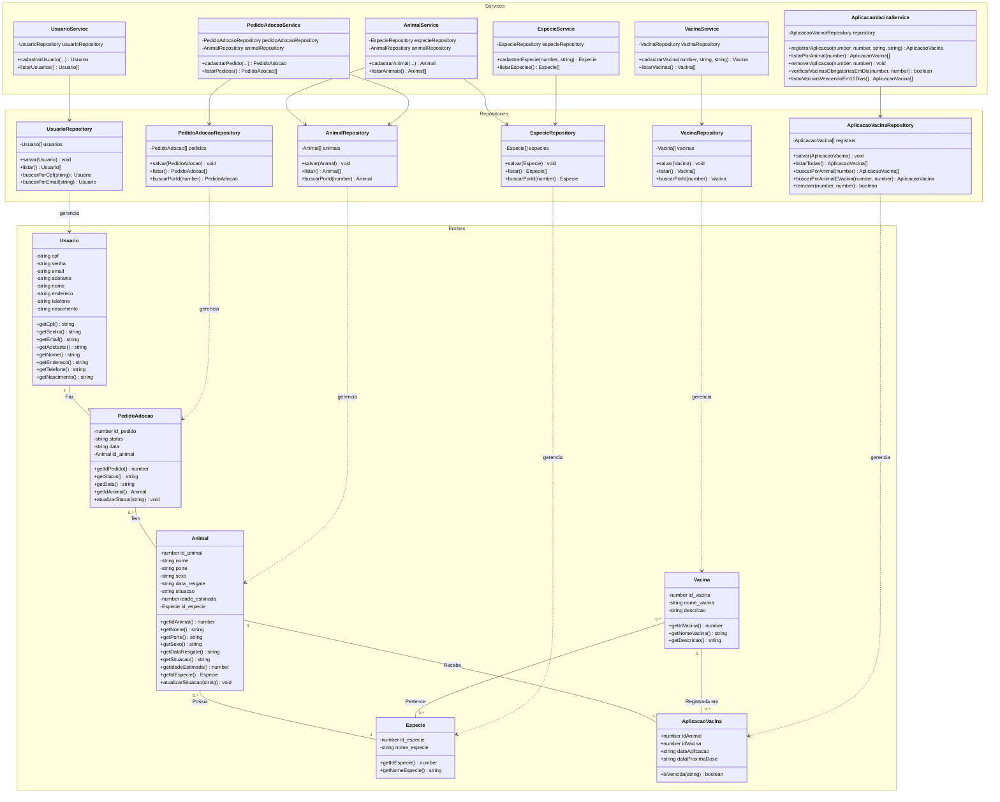

```mermaid
classDiagram
direction TB

namespace Entities {
    class Usuario {
        -string cpf
        -string senha
        -string email
        -string adotante
        -string nome
        -string endereco
        -string telefone
        -string nascimento
        +getCpf() string
        +getSenha() string
        +getEmail() string
        +getAdotante() string
        +getNome() string
        +getEndereco() string
        +getTelefone() string
        +getNascimento() string
    }

    class Animal {
        -number id_animal
        -string nome
        -string porte
        -string sexo
        -string data_resgate
        -string situacao
        -number idade_estimada
        -Especie id_especie
        +getIdAnimal() number
        +getNome() string
        +getPorte() string
        +getSexo() string
        +getDataResgate() string
        +getSituacao() string
        +getIdadeEstimada() number
        +getIdEspecie() Especie
        +atualizarSituacao(string) void
    }

    class Especie {
        -number id_especie
        -string nome_especie
        +getIdEspecie() number
        +getNomeEspecie() string
    }

    class Vacina {
        -number id_vacina
        -string nome_vacina
        -string descricao
        +getIdVacina() number
        +getNomeVacina() string
        +getDescricao() string
    }

    class PedidoAdocao {
        -number id_pedido
        -string status
        -string data
        -Animal id_animal
        +getIdPedido() number
        +getStatus() string
        +getData() string
        +getIdAnimal() Animal
        +atualizarStatus(string) void
    }

    class AplicacaoVacina {
        +number idAnimal
        +number idVacina
        +string dataAplicacao
        +string dataProximaDose
        +isVencida(string) boolean
    }
}

namespace Repositories {
    class UsuarioRepository {
        -Usuario[] usuarios
        +salvar(Usuario) void
        +listar() Usuario[]
        +buscarPorCpf(string) Usuario
        +buscarPorEmail(string) Usuario
    }

    class AnimalRepository {
        -Animal[] animais
        +salvar(Animal) void
        +listar() Animal[]
        +buscarPorId(number) Animal
    }

    class EspecieRepository {
        -Especie[] especies
        +salvar(Especie) void
        +listar() Especie[]
        +buscarPorId(number) Especie
    }

    class VacinaRepository {
        -Vacina[] vacinas
        +salvar(Vacina) void
        +listar() Vacina[]
        +buscarPorId(number) Vacina
    }

    class PedidoAdocaoRepository {
        -PedidoAdocao[] pedidos
        +salvar(PedidoAdocao) void
        +listar() PedidoAdocao[]
        +buscarPorId(number) PedidoAdocao
    }

    class AplicacaoVacinaRepository {
        -AplicacaoVacina[] registros
        +salvar(AplicacaoVacina) void
        +listarTodas() AplicacaoVacina[]
        +buscarPorAnimal(number) AplicacaoVacina[]
        +buscarPorAnimalEVacina(number, number) AplicacaoVacina
        +remover(number, number) boolean
    }
}

namespace Services {
    class UsuarioService {
        -UsuarioRepository usuarioRepository
        +cadastrarUsuario(...) Usuario
        +listarUsuarios() Usuario[]
    }

    class AnimalService {
        -EspecieRepository especieRepository
        -AnimalRepository animalRepository
        +cadastrarAnimal(...) Animal
        +listarAnimais() Animal[]
    }

    class EspecieService {
        -EspecieRepository especieRepository
        +cadastrarEspecie(number, string) Especie
        +listarEspecies() Especie[]
    }

    class VacinaService {
        -VacinaRepository vacinaRepository
        +cadastrarVacina(number, string, string) Vacina
        +listarVacinas() Vacina[]
    }

    class PedidoAdocaoService {
        -PedidoAdocaoRepository pedidoAdocaoRepository
        -AnimalRepository animalRepository
        +cadastrarPedido(...) PedidoAdocao
        +listarPedidos() PedidoAdocao[]
    }

    class AplicacaoVacinaService {
        -AplicacaoVacinaRepository repository
        +registrarAplicacao(number, number, string, string) AplicacaoVacina
        +listarPorAnimal(number) AplicacaoVacina[]
        +removerAplicacao(number, number) void
        +verificarVacinasObrigatoriasEmDia(number, number) boolean
        +listarVacinasVencendoEm15Dias() AplicacaoVacina[]
    }
}

%% RELACIONAMENTOS ENTRE ENTITIES

Usuario "1" -- "0..*" PedidoAdocao : Faz
PedidoAdocao "0..*" -- "1" Animal : Tem
Animal "0..*" -- "1" Especie : Possui
Vacina "0..*" -- "0..*" Especie : Pertence
Animal "1" -- "0..*" AplicacaoVacina : Recebe
Vacina "1" -- "0..*" AplicacaoVacina : Registrada em

%% REPOSITORIES

UsuarioRepository ..> Usuario : gerencia
AnimalRepository ..> Animal : gerencia
EspecieRepository ..> Especie : gerencia
VacinaRepository ..> Vacina : gerencia
PedidoAdocaoRepository ..> PedidoAdocao : gerencia
AplicacaoVacinaRepository ..> AplicacaoVacina : gerencia

%% SERVICES

UsuarioService --> UsuarioRepository
AnimalService --> AnimalRepository
AnimalService --> EspecieRepository
EspecieService --> EspecieRepository
VacinaService --> VacinaRepository
PedidoAdocaoService --> PedidoAdocaoRepository
PedidoAdocaoService --> AnimalRepository
AplicacaoVacinaService --> AplicacaoVacinaRepository
```
